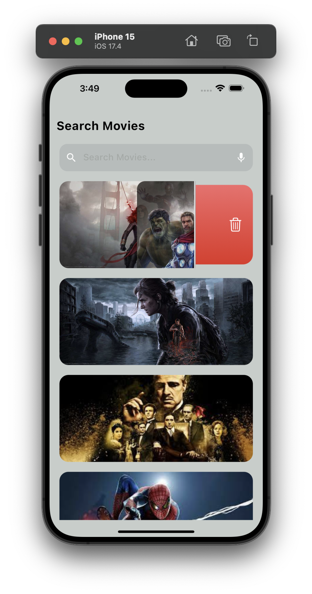
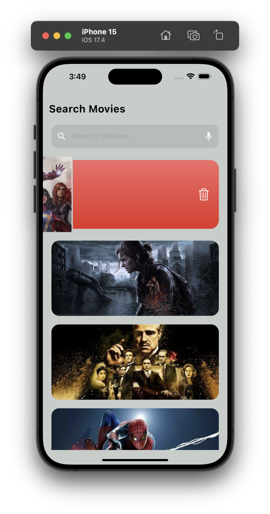
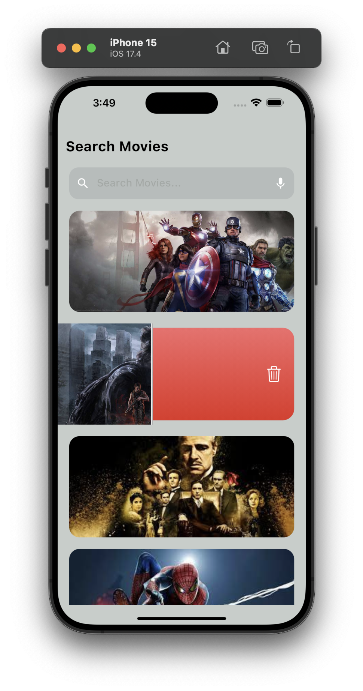

# flutter_page_peel_swip

The #swiping-animation in this project has been achieved without the use of any third-party packages or dart packages. Every aspect of the animation has been created manually. I welcome any contributions and encourage you to fork the project.

## Images:  

 
 
 
 